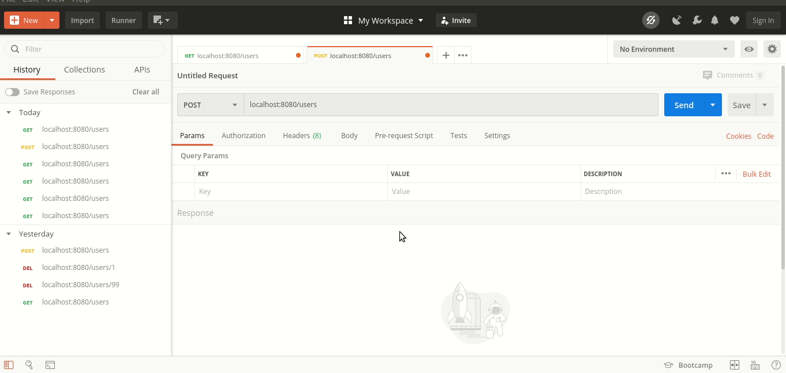
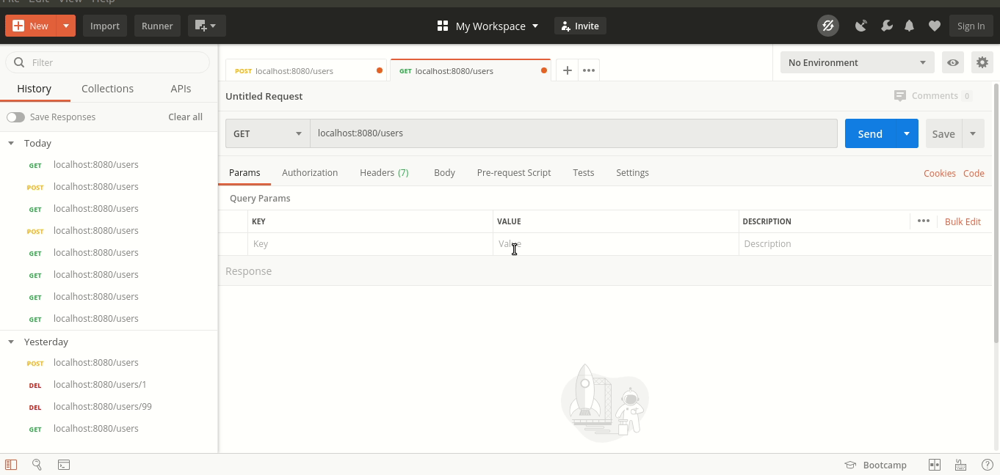

# Exercise : RestFul Web Service Part 2

## Internationalization

### Q1.  Add support for Internationalization in your application allowing messages to be shown in English, German and Swedish, keeping English as default.

### Q2. Create a GET request which takes "username" as param and shows a localized message "Hello Username". (Use parameters in message properties)


## Content Negotiation


### To enable XML support we just need to add [```jackson-dataformat-xml```](https://mvnrepository.com/artifact/com.fasterxml.jackson.dataformat/jackson-dataformat-xml) as a dependency, spring boot autoconfigures it and we can start using it straight away. 
```
compile group: 'com.fasterxml.jackson.dataformat', name: 'jackson-dataformat-xml', version: '2.10.2'
```


### Q3. Create POST Method to create user details which can accept XML for user creation.

```java
@PostMapping("/users")
    public ResponseEntity createUser(@Valid @RequestBody User user){
        userDaoService.addUser(user);

        URI location = ServletUriComponentsBuilder
                .fromCurrentRequest()
                .path("/{id}")
                .buildAndExpand(user.getId())
                .toUri();

        return ResponseEntity.created(location).build();
    }
```

#### Demonstration : 



### Q4. Create GET Method to fetch the list of users in XML format.

```java
@GetMapping("/users")
    public List<User> getAllUsers(){
        return userDaoService.retrieveAllUsers();
    }
```

#### Demonstration : 



## Swagger

### To enable swagger documentation, we need to add 2 dependencies.

#### 1. [Swagger2](https://mvnrepository.com/artifact/io.springfox/springfox-swagger2) : the core swagger dependency required to enable swagger

```
compile group: 'io.springfox', name: 'springfox-swagger2', version: '2.9.2'
```

#### 2. [Swagger UI](https://mvnrepository.com/artifact/io.springfox/springfox-swagger-ui) : provides a user friendly HTML UI for the api documentation

```

compile group: 'io.springfox', name: 'springfox-swagger-ui', version: '2.9.2'

```

Now we need to configure swagger by creating a configuration class

```java
@Configuration
@EnableSwagger2
public class SwaggerConfig {
    
    @Bean
    public Docket api(){
        return new Docket(DocumentationType.SWAGGER_2);
    }
}

```

This much is the bare minimum setup, now we can view the documentation on ***/v2/api-docs*** and ***/swagger-ui.html***.

### Q5. Configure swagger plugin and create document of following methods:
- Get details of User using GET request.
- Save details of the user using POST request.
- Delete a user using DELETE request.


### Q6. In swagger documentation, add the description of each class and URI so that in swagger UI the purpose of class                  and URI is clear.

## 4. Static and Dynamic Filtering


## 5. Versioning RESTful APIs


## 6. HATEOAS

