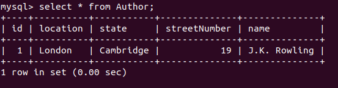
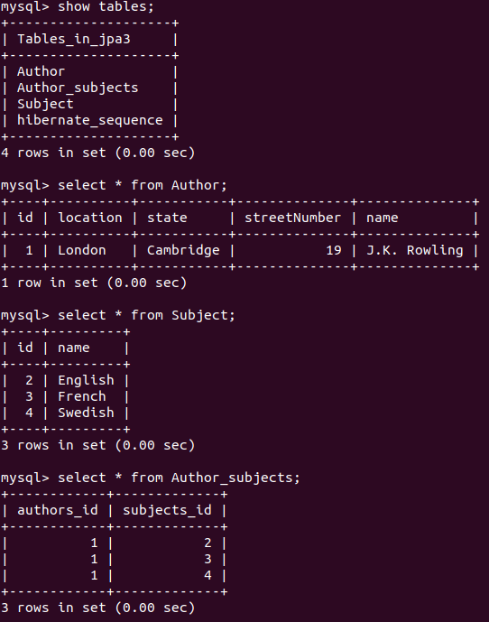
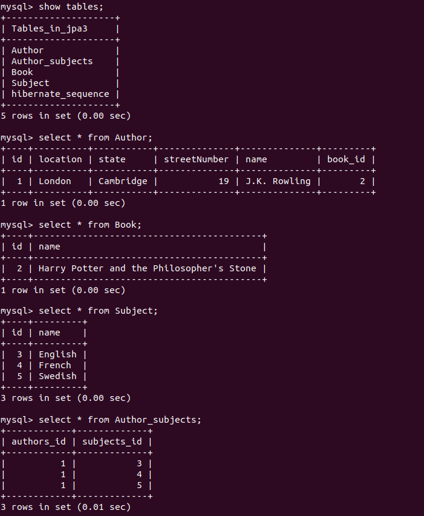
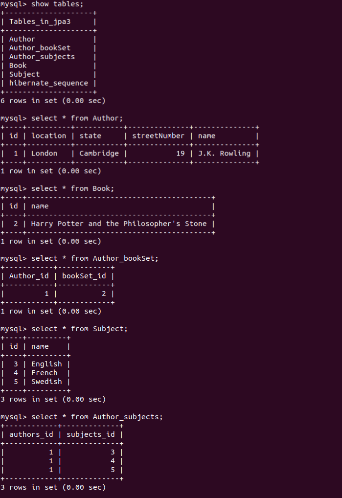
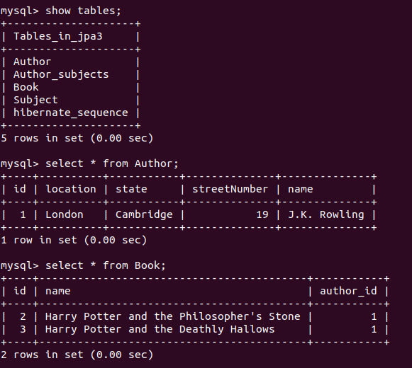

## Exercise : Spring Data JPA with Hibernate Part 3  

### Q1. Create a class Address for Author with instance variables streetNumber, location, State.

[Address](project-files/spring-data-jpa-hibernate-3/src/main/java/com/chiragbohet/springdatajpahibernate3/Embeddable/Address.java)

```java
@Getter
@Setter
@Embeddable
public class Address {

    private int streetNumber;
    private String location;
    private String state;

}
````

### Q2. Create instance variable of Address class inside Author class and save it as embedded object.

[Author](project-files/spring-data-jpa-hibernate-3/src/main/java/com/chiragbohet/springdatajpahibernate3/Entities/Author.java)

```java
@Getter
@Setter
@Entity
public class Author {

    @Id
    @GeneratedValue(strategy = GenerationType.AUTO)
    int id;
    String name;

    @Embedded
    Address address;
}
```

#### Test method for insertion 

[SpringDataJpaHibernate3ApplicationTests](project-files/spring-data-jpa-hibernate-3/src/test/java/com/chiragbohet/springdatajpahibernate3/SpringDataJpaHibernate3ApplicationTests.java)

```java
	@Autowired
	AuthorRepository authorRepository;

	@Test
	void addTestData(){
		Author author = new Author();

		author.setName("J.K. Rowling");

		Address address = new Address();
		address.setStreetNumber(19);
		address.setLocation("London");
		address.setState("Cambridge");
		
		author.setAddress(address);
		
		authorRepository.save(author);
	}
```

#### MySQL screenshot :



### Q3. Introduce a List of subjects for author.

[Subject](project-files/spring-data-jpa-hibernate-3/src/main/java/com/chiragbohet/springdatajpahibernate3/Entities/Subject.java)

```java
@Getter
@Setter
@Entity
public class Subject {

    @Id
    @GeneratedValue(strategy = GenerationType.AUTO)
    int id;
    String name;

    @ManyToMany(mappedBy = "subjects")
    List<Author> authors;

}
```

Key annotation here is ```@ManyToMany(mappedBy = "subjects")```


[Author](project-files/spring-data-jpa-hibernate-3/src/main/java/com/chiragbohet/springdatajpahibernate3/Entities/Author.java)

```java
@Getter
@Setter
@Entity
public class Author {

    @Id
    @GeneratedValue(strategy = GenerationType.AUTO)
    int id;
    String name;

    @Embedded
    Address address;

    @ManyToMany(fetch = FetchType.EAGER, cascade = CascadeType.ALL)
    List<Subject> subjects;

}
```

Key annotation here is ```@ManyToMany(fetch = FetchType.EAGER, cascade = CascadeType.ALL)```

Since a author can study many subjects and a subject can be studied by many authors, there is a Many to Many relation ship between the two Entities.

### Q4. Persist 3 subjects for each author.

### Test Method

[SpringDataJpaHibernate3ApplicationTests](project-files/spring-data-jpa-hibernate-3/src/test/java/com/chiragbohet/springdatajpahibernate3/SpringDataJpaHibernate3ApplicationTests.java)

```java
	@Autowired
	AuthorRepository authorRepository;

	@Test
	void addTestData(){
		Author author = new Author();

		author.setName("J.K. Rowling");

		Address address = new Address();
		address.setStreetNumber(19);
		address.setLocation("London");
		address.setState("Cambridge");

		author.setAddress(address);

		Subject eng = new Subject();
		eng.setName("English");

		Subject fr = new Subject();
		fr.setName("French");

		Subject sw = new Subject();
		sw.setName("Swedish");

		List<Subject> subjects = Arrays.asList(eng,fr,sw);

		author.setSubjects(subjects);

		authorRepository.save(author);
	}
```


#### MySQL screenshot :




### Q5. Create an Entity book with an instance variable bookName.

[Book](project-files/spring-data-jpa-hibernate-3/src/main/java/com/chiragbohet/springdatajpahibernate3/Entities/Book.java)

```java
@Getter
@Setter
@Entity
public class Book {

    @Id
    @GeneratedValue(strategy = GenerationType.AUTO)
    int id;

    String name;
}
```

### Q6. Implement One to One mapping between Author and Book.

[Author](project-files/spring-data-jpa-hibernate-3/src/main/java/com/chiragbohet/springdatajpahibernate3/Entities/Author.java)

```java
@Getter
@Setter
@Entity
public class Author {

    @Id
    @GeneratedValue(strategy = GenerationType.AUTO)
    int id;
    String name;

    @Embedded
    Address address;

    @ManyToMany(fetch = FetchType.EAGER, cascade = CascadeType.ALL)
    List<Subject> subjects;

    @OneToOne(cascade = CascadeType.ALL, fetch = FetchType.EAGER)
    Book book;

}
```

[Book](project-files/spring-data-jpa-hibernate-3/src/main/java/com/chiragbohet/springdatajpahibernate3/Entities/Book.java)

```java
@Getter
@Setter
@Entity
public class Book {

    @Id
    @GeneratedValue(strategy = GenerationType.AUTO)
    int id;
    String name;

    @OneToOne(mappedBy = "book")
    Author author;

}
```

### Test Method

```java
@Autowired
	AuthorRepository authorRepository;

	@Test
	void addTestData(){
		Author author = new Author();

		author.setName("J.K. Rowling");

		Address address = new Address();
		address.setStreetNumber(19);
		address.setLocation("London");
		address.setState("Cambridge");

		author.setAddress(address);

		Subject eng = new Subject();
		eng.setName("English");

		Subject fr = new Subject();
		fr.setName("French");

		Subject sw = new Subject();
		sw.setName("Swedish");

		List<Subject> subjects = Arrays.asList(eng,fr,sw);

		author.setSubjects(subjects);

		Book book = new Book();
		book.setName("Harry Potter and the Philosopher's Stone");
		author.setBook(book);

		authorRepository.save(author);
	}
```

### MySQl screenshot : 



### Q7. Implement One to Many Mapping between Author and Book(Unidirectional, BiDirectional and without additional table ) and implement cascade save.

#### 7.1 One To Many Unidirectional

[Author](project-files/spring-data-jpa-hibernate-3/src/main/java/com/chiragbohet/springdatajpahibernate3/Entities/Author.java)

```java
@Getter
@Setter
@Entity
public class Author {

    @Id
    @GeneratedValue(strategy = GenerationType.AUTO)
    int id;
    String name;

    @Embedded
    Address address;

    @ManyToMany(fetch = FetchType.EAGER, cascade = CascadeType.ALL)
    List<Subject> subjects;

    // OneToMany Unidirectional
    @OneToMany(cascade = CascadeType.ALL)
    Set<Book> bookSet;


    public void setBooks(Book... book){
        if(book != null)
        {
            if(bookSet == null)
                bookSet = new HashSet<>();

            for(Book bookEntry : book)
                bookSet.add(bookEntry);
        }
    }


}
```

Key code fragment : 

```java
  @OneToMany(cascade = CascadeType.ALL)
    Set<Book> bookSet;
```

[Book](project-files/spring-data-jpa-hibernate-3/src/main/java/com/chiragbohet/springdatajpahibernate3/Entities/Book.java)

```java
@Getter
@Setter
@Entity
public class Book {

    @Id
    @GeneratedValue(strategy = GenerationType.AUTO)
    int id;
    String name;

}
```

Since we want a unidirectional relationshiop, there's no instance member of type Author in Book.

#### Test Method

[SpringDataJpaHibernate3ApplicationTests](project-files/spring-data-jpa-hibernate-3/src/test/java/com/chiragbohet/springdatajpahibernate3/SpringDataJpaHibernate3ApplicationTests.java)

```java
@Autowired
	AuthorRepository authorRepository;

	@Test
	void addTestData(){
		Author author = new Author();

		author.setName("J.K. Rowling");

		Address address = new Address();
		address.setStreetNumber(19);
		address.setLocation("London");
		address.setState("Cambridge");

		author.setAddress(address);

		Subject eng = new Subject();
		eng.setName("English");

		Subject fr = new Subject();
		fr.setName("French");

		Subject sw = new Subject();
		sw.setName("Swedish");

		List<Subject> subjects = Arrays.asList(eng,fr,sw);

		author.setSubjects(subjects);

		Book book = new Book();
		book.setName("Harry Potter and the Philosopher's Stone");

		author.setBooks(book);

		authorRepository.save(author);
	}
```

### MySQl screenshot : 



#### 7.2 One To Many Unidirectional and without additional Table.

To stop creation of additional mapping table, we simply need to add one more annotation ```@JoinColumn``` to the ```bookSet``` member variable.

```java
    @OneToMany(cascade = CascadeType.ALL)
    @JoinColumn(name="author_id")
    Set<Book> bookSet;
```

### MySQl screenshot : 




### 7.3 One To Many Bidirectional

To make this relationship One to Many bidirectional, we need to add Author as a member variable inside Book as : 

```java
    @ManyToOne
    @JoinColumn(name = "author_id")
    Author author;
```

### Q8. Implement Many to Many Mapping between Author and Book.

To make this relation Many to Many, we need to replace the ```@ManyToOne``` annotation with ```@ManyToMany``` in both Author and Book. (Bidirectional)

Author

```java
    // ManyToMany
    @ManyToMany(cascade = CascadeType.ALL, fetch = FetchType.EAGER)
    Set<Book> bookSet;
```

Book

```java
    @ManyToMany(mappedBy = "bookSet")
    Set<Author> authors;
```

### Q9. Which method on the session object can be used to remove an object from the cache?

```evict()```

### Q10. What does @transactional annotation do?

```@Transactional``` annotation on a method annotated with ```@Test``` treats it as a Transaction, i.e. if the method fails all the changes done by the method are rolled back.
Even if the method executes successfully, the changes are rolled back by default, to stop this behavior we can add another annotation ```@Rollback(false)``` to stop this from happening.  