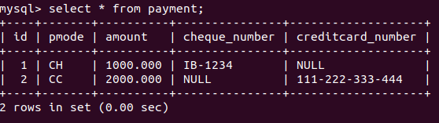
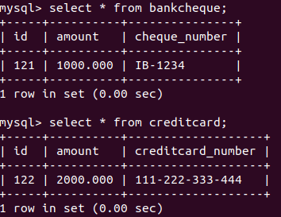
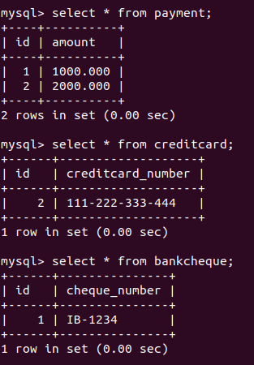

## Exercise : Spring Data JPA with Hibernate Part 2

### Instructions for JPQL and Native SQL Query

- Create an employeeTable table with the following fields: empId, empFirstName, empLastName, empSalary, empAge.

- Create an Employee entity having following fields: id, firstName, lastName, salary, age which maps to the table columns given in above.
JPQL:

#### 1. Setting up MySQL

```sql
CREATE DATABASE jpql_and_native_sql;

USE jpql_and_native_sql;

CREATE TABLE employeeTable(
    empId INT PRIMARY KEY AUTO_INCREMENT,
    empFirstName VARCHAR(20),
    empLastName VARCHAR(20),
    empSalary DECIMAL,
    empAge TINYINT
);
```

Or use [this](project-files/jpql-native-sql/mysqldump.sql) dump file

#### 2. Creating Entities

[Employee](project-files/jpql-native-sql/src/main/java/com/chiragbohet/jpqlnativesql/Entities/Employee.java)

```java
@Getter
@Setter
@Entity
@ToString
@Table(name = "employeeTable")
public class Employee {

    @Id
    @GeneratedValue(strategy = GenerationType.IDENTITY)
    @Column(name="empId")
    int id;

    @Column(name = "empFirstName")
    String firstName;

    @Column(name = "empLastName")
    String lastName;

    @Column(name = "empSalary")
    BigDecimal salary;

    @Column(name = "empAge")
    int age;

}
```

#### 3. Creating Repository

[EmployeeRepository](project-files/jpql-native-sql/src/main/java/com/chiragbohet/jpqlnativesql/Repositories/EmployeeRepository.java)

```java
public interface EmployeeRepository extends CrudRepository<Employee, Integer> {}
```


### JPQL Query: 

### Q1. Display the first name, last name of all employees having salary greater than average salary ordered in ascending by their age and in descending by their salary.

[EmployeeRepository](project-files/jpql-native-sql/src/main/java/com/chiragbohet/jpqlnativesql/Repositories/EmployeeRepository.java)

```java
    @Query("SELECT firstName, lastName FROM Employee WHERE salary > (SELECT AVG(salary) FROM Employee) ORDER BY age ASC, salary DESC")
    List<Object[]> Q1_findFirstLastName();
```

### Q2. Update salary of all employees by a salary passed as a parameter whose existing salary is less than the average salary.

### Q3. Delete all employees with minimum salary.

### Native SQL Query:

### Q4. Display the id, first name, age of all employees where last name ends with "singh"

[EmployeeRepository](project-files/jpql-native-sql/src/main/java/com/chiragbohet/jpqlnativesql/Repositories/EmployeeRepository.java)

```java
   @Query(value = "SELECT empId, empFirstName, empAge FROM employeeTable WHERE empLastName LIKE '%singh'", nativeQuery = true)
    List<Object[]> Q4_findLastNameEndingInSingh();
```


### Q5. Delete all employees with age greater than 45(Should be passed as a parameter)

[EmployeeRepository](project-files/jpql-native-sql/src/main/java/com/chiragbohet/jpqlnativesql/Repositories/EmployeeRepository.java)

```java
   @Modifying
    @Query(value = "DELETE FROM employeeTable WHERE empAge > :inputAge", nativeQuery = true)
    void Q5_deleteAllWithAgeGreaterThan(@Param("inputAge") int age);
```

### Q6. Implement and demonstrate Single Table strategy

#### In Single Table Inheritance mapping strategy, one single table is created which saves data for all the child entities. Each entry is diffrentiated by means of an discriminatory value which are stored in a discriminatory column

#### 1. Setting up MySQL

```sql
CREATE DATABASE inheritance_using_single_table_strategy;

USE inheritance_using_single_table_strategy;

CREATE TABLE payment(
    id INT PRIMARY KEY AUTO_INCREMENT,
    pmode VARCHAR(2),
    amount DECIMAL(8,3),
    cheque_number VARCHAR(20),
    creditcard_number VARCHAR(20)
);
```

Or use [this](project-files/inheritance-single-table/mysqldump.sql) dump file

#### 2. Creating Entities

[Payment](project-files/inheritance-single-table/src/main/java/com/chiragbohet/inheritancesingletable/Entities/Payment.java)

```java
@Getter
@Setter
@Entity
@Table(name = "payment")
@Inheritance(strategy = InheritanceType.SINGLE_TABLE)
@DiscriminatorColumn(name = "pmode", discriminatorType = DiscriminatorType.STRING)
public abstract class Payment {

    @Id
    @GeneratedValue(strategy = GenerationType.IDENTITY)
    int id;
    int amount;
}
```

The key annotations here are ```@Inheritance(strategy = InheritanceType.SINGLE_TABLE)``` and
```@DiscriminatorColumn(name = "pmode", discriminatorType = DiscriminatorType.STRING)```

[Cheque](project-files/inheritance-single-table/src/main/java/com/chiragbohet/inheritancesingletable/Entities/Cheque.java)

```java
@Getter
@Setter
@Entity
@DiscriminatorValue("CH")
public class Cheque extends Payment {
    @Column(name = "cheque_number")
    private String ChequeNumber;
}
```

The key annotation here is ```@DiscriminatorValue("CH")```

[CreditCard](project-files/inheritance-single-table/src/main/java/com/chiragbohet/inheritancesingletable/Entities/CreditCard.java)

```java
@Getter
@Setter
@Entity
@DiscriminatorValue("CC")
public class CreditCard extends Payment {
    @Column(name = "creditcard_number")
    private String CreditCardNumber;
}
```

The key annotation here is ```@DiscriminatorValue("CC")```

#### 3. Creating Repository

[PaymentRepository](project-files/inheritance-single-table/src/main/java/com/chiragbohet/inheritancesingletable/Repository/PaymentRepository.java)

```java
public interface PaymentRepository extends CrudRepository<Payment, Integer> { }
```

#### 4. Writing a Test method

[InheritanceSingleTableApplicationTests](project-files/inheritance-single-table/src/test/java/com/chiragbohet/inheritancesingletable/InheritanceSingleTableApplicationTests.java)

```java

@Autowired
	PaymentRepository paymentRepository;

@Test
    void testCreate() {
        Cheque cheque = new Cheque();
        cheque.setChequeNumber("IB-1234");
        cheque.setAmount(1000);

        paymentRepository.save(cheque);

        CreditCard creditCard = new CreditCard();
        creditCard.setCreditCardNumber("111-222-333-444");
        creditCard.setAmount(2000);

        paymentRepository.save(creditCard);
    }
```

#### MySQL screenshot



### Q7. Implement and demonstrate Table Per Class strategy

#### In Table per Class Inheritance mapping strategy, each concrete child entity has its own table.

#### 1. Setting up MySQL

```sql
CREATE DATABASE inheritance_using_table_per_class_strategy;

USE inheritance_using_table_per_class_strategy;

CREATE TABLE creditcard(
    id INT PRIMARY KEY,
    amount DECIMAL(8,3),
    creditcard_number VARCHAR(20)

);

CREATE TABLE bankcheque(
   id INT PRIMARY KEY,
   amount DECIMAL(8,3),
   cheque_number VARCHAR(20)
);
```

Or use  [this](project-files/inheritance-table-per-class/mysqldump.sql) dump file

#### 2. Creating Entities

[Payment](project-files/inheritance-table-per-class/src/main/java/com/chiragbohet/inheritancetableperclass/Entities/Payment.java)

```java
@Getter
@Setter
@Entity
@Inheritance(strategy = InheritanceType.TABLE_PER_CLASS)
public abstract class Payment {

    @Id
    int id;
    int amount;

}
```

The key annotation here is ```@Inheritance(strategy = InheritanceType.TABLE_PER_CLASS)```


[Cheque](project-files/inheritance-table-per-class/src/main/java/com/chiragbohet/inheritancetableperclass/Entities/Cheque.java)

```java
@Getter
@Setter
@Entity
@Table(name = "bankcheque")
public class Cheque extends Payment {

    @Column(name = "cheque_number")
    private String ChequeNumber;

}
```

[CreditCard](project-files/inheritance-table-per-class/src/main/java/com/chiragbohet/inheritancetableperclass/Entities/CreditCard.java)

```java
@Getter
@Setter
@Entity
@Table(name = "bankcheque")
public class Cheque extends Payment {

    @Column(name = "cheque_number")
    private String ChequeNumber;

}
```

#### 3. Creating Repository

[PaymentRepository](project-files/inheritance-table-per-class/src/main/java/com/chiragbohet/inheritancetableperclass/Repositories/PaymentRepository.java)

```java
public interface PaymentRepository extends CrudRepository<Payment, Integer> { }
```

#### 4. Writing a Test method

[InheritanceTablePerClassApplicationTests](project-files/inheritance-table-per-class/src/test/java/com/chiragbohet/inheritancetableperclass/InheritanceTablePerClassApplicationTests.java)

```java

    @Autowired
	PaymentRepository paymentRepository;

    @Test
	void testCreate() {
	    Cheque cheque = new Cheque();
	    cheque.setId(121);
	    cheque.setChequeNumber("IB-1234");
	    cheque.setAmount(1000);

	    paymentRepository.save(cheque);

	    CreditCard creditCard = new CreditCard();
	    creditCard.setId(122);
	    creditCard.setCreditCardNumber("111-222-333-444");
	    creditCard.setAmount(2000);

	paymentRepository.save(creditCard);

	}
```

#### MySQL screenshot



### Q8. Implement and demonstrate Joined strategy.

#### 1. Setting up MySQL

```sql
CREATE DATABASE inheritance_using_joined_table_strategy;

USE inheritance_using_joined_table_strategy;

CREATE TABLE payment(
    id INT PRIMARY KEY AUTO_INCREMENT,
    amount DECIMAL(8,3)
);

CREATE TABLE creditcard(
    id INT,
    creditcard_number VARCHAR(20),
    FOREIGN KEY (id) REFERENCES payment(id)
);

CREATE TABLE bankcheque(
    id INT,
    cheque_number VARCHAR(20),
    FOREIGN KEY (id) REFERENCES payment(id)
);

```

Or use [this](project-files/inheritance-single-table/mysqldump.sql) dump file

#### 2. Creating Entities

[Payment](project-files/inheritance-joined/src/main/java/Entities/Payment.java)

```java
@Getter
@Setter
@Entity
@Inheritance(strategy = InheritanceType.JOINED)
public abstract class Payment {

    @Id
    @GeneratedValue(strategy = GenerationType.IDENTITY)
    int id;
    int amount;

}
```

Key annotation here is ```@Inheritance(strategy = InheritanceType.JOINED)```

[Cheque](project-files/inheritance-joined/src/main/java/com/chiragbohet/inheritancejoined/Entities/Cheque.java)

```java
@Getter
@Setter
@Entity
@Table(name = "bankcheque")
@PrimaryKeyJoinColumn(name = "id")
public class Cheque extends Payment {

    @Column(name = "cheque_number")
    private String ChequeNumber;

}
```

Key annotation here is ```@PrimaryKeyJoinColumn(name = "id")```

[CreditCard](project-files/inheritance-joined/src/main/java/com/chiragbohet/inheritancejoined/Entities/CreditCard.java)

```java
@Entity
@Getter
@Setter
@Table(name = "creditcard")
@PrimaryKeyJoinColumn(name = "id")
public class CreditCard extends Payment {

    @Column(name = "creditcard_number")
    private String creditCardNumber;

}
```

Key annotation here is ```@PrimaryKeyJoinColumn(name = "id")```

#### 3. Creating Repository

[PaymentRepository](project-files/inheritance-joined/src/main/java/com/chiragbohet/inheritancejoined/Repositories/PaymentRepository.java)

```java
public interface PaymentRepository extends CrudRepository<Payment, Integer> { }
```

#### 4. Testing using a Test method

[InheritanceJoinedApplicationTests](project-files/inheritance-joined/src/test/java/com/chiragbohet/inheritancejoined/InheritanceJoinedApplicationTests.java)

```java
@Autowired
	PaymentRepository paymentRepository;

	@Test
	void testCreate() {

		Cheque cheque = new Cheque();
		cheque.setChequeNumber("IB-1234");
		cheque.setAmount(1000);

		paymentRepository.save(cheque);

		CreditCard creditCard = new CreditCard();
		creditCard.setCreditCardNumber("111-222-333-444");
		creditCard.setAmount(2000);

		paymentRepository.save(creditCard);

	}
```

#### MySQL screenshot




Component Mapping:

Implement and demonstrate Embedded mapping using employee table having following fields: id, firstName, lastName, age, basicSalary, bonusSalary, taxAmount, specialAllowanceSalary.

#### 1. Setting up MySQL

```sql
CREATE DATABASE component_mapping;

USE component_mapping;

CREATE TABLE employeeTable(
    empId INT PRIMARY KEY AUTO_INCREMENT,
    empFirstName VARCHAR(20),
    empLastName VARCHAR(20),
    empAge TINYINT,
    basic_salary DECIMAL,
    bonus_salary DECIMAL,
    tax_amount DECIMAL,
    special_allowance_salary DECIMAL
);
```

Or use [this](project-files/component-mapping/mysqldump.sql) dump file

#### 2. Creating Entities

[Employee](project-files/component-mapping/src/main/java/com/chiragbohet/componentmapping/Entities/Employee.java)

```java
@Getter
@Setter
@Entity
@Table(name = "employeeTable")
public class Employee {

    @Id
    @GeneratedValue(strategy = GenerationType.IDENTITY)
    @Column(name = "empId")
    Integer id;

    @Column(name = "empFirstName")
    String firstName;

    @Column(name = "empLastName")
    String lastName;

    @Column(name = "empAge")
    Integer age;

    @Embedded
    Salary salary;

}
```

Key annotation here is ```@Embedded```

[Salary](project-files/component-mapping/src/main/java/com/chiragbohet/componentmapping/Entities/Salary.java)

```java
@Getter
@Setter
@Embeddable
public class Salary {

    @Column(name = "basic_salary")
    BigDecimal basicSalary;

    @Column(name = "bonus_salary")
    BigDecimal bonusSalary;

    @Column(name = "tax_amount")
    BigDecimal taxAmount;

    @Column(name = "special_allowance_salary")
    BigDecimal specialAllowanceSalary;
}
```

#### 3. Creating Repository

[EmployeeRepository](project-files/component-mapping/src/main/java/com/chiragbohet/componentmapping/Repositories/EmployeeRepository.java)

```java
public interface EmployeeRepository extends CrudRepository<Employee, Integer> {
}
```

#### 4. Testing using a Test method

[ComponentMappingApplicationTests](project-files/component-mapping/src/test/java/com/chiragbohet/componentmapping/ComponentMappingApplicationTests.java)

```java
@Autowired
	EmployeeRepository employeeRepository;

	@Test
	void testCreate(){
		Employee employee = new Employee();
		employee.setFirstName("Chirag");
		employee.setLastName("Bohet");
		employee.setAge(24);

		Salary salary = new Salary();
		salary.setBasicSalary(new BigDecimal("10000"));
		salary.setBonusSalary(new BigDecimal("3000"));
		salary.setSpecialAllowanceSalary(new BigDecimal("20000"));
		salary.setTaxAmount(new BigDecimal("0"));

		employee.setSalary(salary);

		employeeRepository.save(employee);
	}
```

#### MySQL screenshot

