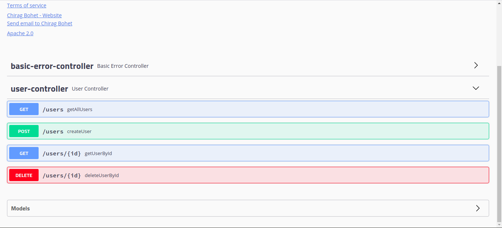
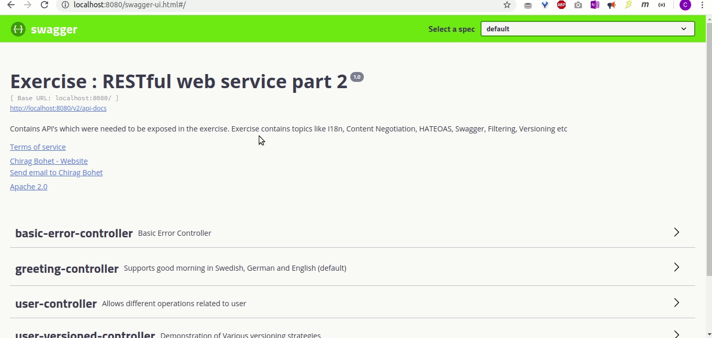

# Exercise : RestFul Web Service Part 2

## Internationalization

### Q1.  Add support for Internationalization in your application allowing messages to be shown in English, German and Swedish, keeping English as default.

### Adding support for Internationalization requires 2 steps

### 1. Creating LocaleResolver and ResourceBundleMessageSource Beans.

```java
  @Bean
    LocaleResolver localeResolver() {
        AcceptHeaderLocaleResolver acceptHeaderLocaleResolver = new AcceptHeaderLocaleResolver();
        acceptHeaderLocaleResolver.setDefaultLocale(Locale.US);
        return acceptHeaderLocaleResolver;
    }

    @Bean
    public ResourceBundleMessageSource messageSource() {
        ResourceBundleMessageSource messageSource = new ResourceBundleMessageSource();
        messageSource.setBasename("greetings");
        return messageSource;
    }
```

### 2. Creating messages files.

- greetings.properties

```
good.morning.message = Good Morning
```

- greetings_de.properties
```
good.morning.message = guten Morgen
```

- greetings_sv.properties
```
good.morning.message = god morgon
```

### Q2. Create a GET request which takes "username" as param and shows a localized message "Hello Username". (Use parameters in message properties)

```java
@RestController
public class GreetingController {

    @Autowired
    MessageSource messageSource;

    @GetMapping("/greeting/{name}")
    public String sayHello(@RequestHeader(name = "Accept-Language", required = false)Locale locale, @PathVariable String name){
        return messageSource.getMessage("good.morning.message",null,locale) + " " +name + "!";
    }
}
```


## Content Negotiation

### To enable XML support we just need to add [```jackson-dataformat-xml```](https://mvnrepository.com/artifact/com.fasterxml.jackson.dataformat/jackson-dataformat-xml) as a dependency, spring boot autoconfigures it and we can start using it straight away. 

```
compile group: 'com.fasterxml.jackson.dataformat', name: 'jackson-dataformat-xml', version: '2.10.2'
```


### Q3. Create POST Method to create user details which can accept XML for user creation.

```java
@PostMapping("/users")
    public ResponseEntity createUser(@Valid @RequestBody User user){
        userDaoService.addUser(user);

        URI location = ServletUriComponentsBuilder
                .fromCurrentRequest()
                .path("/{id}")
                .buildAndExpand(user.getId())
                .toUri();

        return ResponseEntity.created(location).build();
    }
```

#### Demonstration : 


### Q4. Create GET Method to fetch the list of users in XML format.

```java
@GetMapping("/users")
    public List<User> getAllUsers(){
        return userDaoService.retrieveAllUsers();
    }
```

#### Demonstration : 


## Swagger

### To enable swagger documentation, we need to add 2 dependencies.

#### 1. [Swagger2](https://mvnrepository.com/artifact/io.springfox/springfox-swagger2) : the core swagger dependency required to enable swagger

```
compile group: 'io.springfox', name: 'springfox-swagger2', version: '2.9.2'
```

#### 2. [Swagger UI](https://mvnrepository.com/artifact/io.springfox/springfox-swagger-ui) : provides a user friendly HTML UI for the api documentation

```

compile group: 'io.springfox', name: 'springfox-swagger-ui', version: '2.9.2'

```

Now we need to configure swagger by creating a configuration class

```java
@Configuration
@EnableSwagger2
public class SwaggerConfig {
    
    @Bean
    public Docket api(){
        return new Docket(DocumentationType.SWAGGER_2);
    }
}

```

This much is the bare minimum setup, now we can view the documentation on ***/v2/api-docs*** and ***/swagger-ui.html***.

### Q5. Configure swagger plugin and create document of following methods:
- Get details of User using GET request.
- Save details of the user using POST request.
- Delete a user using DELETE request.

#### screenshot



### Q6. In swagger documentation, add the description of each class and URI so that in swagger UI the purpose of class and URI is clear.

#### UserController

```java
@Api(value = "/users",description = "Allows different operations related to user")
@RestController
public class UserController {

    @Autowired
    UserDaoService userDaoService;

    @ApiOperation(value = "Retrieves list of all users.")
    @GetMapping("/users")
    public List<User> getAllUsers(){
        return userDaoService.retrieveAllUsers();
    }

    @ApiOperation(value = "Retrieves a user with the given id.")
    @GetMapping("/users/{id}")
    public User getUserById(@PathVariable int id){
        User requestedUser = userDaoService.retrieveUserById(id);

        if(requestedUser != null)
            return requestedUser;
        else
            throw new UserNotFoundException("No user found with id : " + id);

    }

    @ApiOperation(value = "Creates a new user")
    @PostMapping("/users")
    public ResponseEntity createUser(@Valid @RequestBody User user){
        userDaoService.addUser(user);

        // filtering response object
        SimpleBeanPropertyFilter passwordFilter = SimpleBeanPropertyFilter.filterOutAllExcept("id","name","age");
        FilterProvider filters = new SimpleFilterProvider().addFilter("UserBasicFilter", passwordFilter);
        MappingJacksonValue mapping = new MappingJacksonValue(user);
        mapping.setFilters(filters);

        URI location = ServletUriComponentsBuilder
                .fromCurrentRequest()
                .path("/{id}")
                .buildAndExpand(user.getId())
                .toUri();

        // for adding location header in the response
        MultiValueMap<String,String> headers = new LinkedMultiValueMap<>();
        headers.put("location", Arrays.asList(location.toString()));


        //Sending the 201 Response code, created object and location header
        return new ResponseEntity<MappingJacksonValue>(mapping, headers, HttpStatus.CREATED);

    }

    @ApiOperation(value = "Deletes user with the given id.")
    @DeleteMapping("/users/{id}")
    public User deleteUserById(@PathVariable int id){
        User deletedUser = userDaoService.deleteUserById(id);
        if(deletedUser != null)
            {
                return deletedUser;
            }
        else
            throw new UserNotFoundException("No user found with id : " + id);
    }
}

```


#### User

```java
@JsonFilter("UserBasicFilter")
@ApiModel(description = "A simple POJO used in exercise for various demonstrations.")
@Getter
@Setter
@AllArgsConstructor
public class User {

    private Integer id;

    @ApiModelProperty(notes = "Name should have atleast 2 characters.")
    @Size(min = 2, message = "Name should have atleast 2 characters.")
    private String name;

    @ApiModelProperty(notes = "Age of user should be >= 18")
    @Min(value = 18, message = "Age of user should be >= 18")
    private Integer age;

    //@JsonIgnore
    @Size(min = 6)
    private String password;

    //@JsonIgnore
    public String getPassword() {
        return password;
    }

   // @JsonProperty
    public void setPassword(String password) {
        this.password = password;
    }
}

```

#### screenshot : 



## Static and Dynamic Filtering

### Q7. Create API which saves details of User (along with the password) but on successfully saving returns only non-critical data. (Use static filtering)

```java
@ApiModel(description = "A simple POJO used in exercise for various demonstrations.")
@Getter
@Setter
@AllArgsConstructor
public class User {

    private Integer id;

    @ApiModelProperty(notes = "Name should have atleast 2 characters.")
    @Size(min = 2, message = "Name should have atleast 2 characters.")
    private String name;

    @ApiModelProperty(notes = "Age of user should be >= 18")
    @Min(value = 18, message = "Age of user should be >= 18")
    private Integer age;

    @JsonIgnore
    @Size(min = 6)
    private String password;

    @JsonIgnore
    public String getPassword() {
        return password;
    }

    @JsonProperty
    public void setPassword(String password) {
        this.password = password;
    }
}

```

References : https://stackoverflow.com/questions/12505141/only-using-jsonignore-during-serialization-but-not-deserialization


### Q8. Create another API that does the same by using Dynamic Filtering.

```java
@ApiOperation(value = "Creates a new user")
    @PostMapping("/users")
    public ResponseEntity createUser(@Valid @RequestBody User user){
        userDaoService.addUser(user);

        // filtering response object
        SimpleBeanPropertyFilter passwordFilter = SimpleBeanPropertyFilter.filterOutAllExcept("id","name","age");
        FilterProvider filters = new SimpleFilterProvider().addFilter("UserBasicFilter", passwordFilter);
        MappingJacksonValue mapping = new MappingJacksonValue(user);
        mapping.setFilters(filters);

        URI location = ServletUriComponentsBuilder
                .fromCurrentRequest()
                .path("/{id}")
                .buildAndExpand(user.getId())
                .toUri();

        // for adding location header in the response
        MultiValueMap<String,String> headers = new LinkedMultiValueMap<>();
        headers.put("location", Arrays.asList(location.toString()));


        //Sending the 201 Response code, created object and location header
        return new ResponseEntity<MappingJacksonValue>(mapping, headers, HttpStatus.CREATED);

    }
```
#### References : 
1. https://docs.spring.io/spring/docs/current/javadoc-api/org/springframework/util/MultiValueMap.html
2. https://stackoverflow.com/questions/54552816/hashmap-vs-multivaluedmap
3. https://docs.spring.io/spring/docs/3.1.x/javadoc-api/org/springframework/http/ResponseEntity.html
4. https://stackoverflow.com/questions/16127454/rest-returning-created-object-with-spring-mvc

## Versioning RESTful APIs

### Q9. Create 2 API for showing user details. The first api should return only basic details of the user and the other API should return more/enhanced details of the user,

### Now apply versioning using : MimeType Versioning, Request Parameter versioning, URI versioning and Custom Header Versioning.

### Utility Methods

```java

    public MappingJacksonValue getUsersBasicUtility()
    {
        List<User> users = userDaoService.retrieveAllUsers();

        // Basic Filter
        SimpleBeanPropertyFilter basicFilter = SimpleBeanPropertyFilter.filterOutAllExcept("id", "name");
        FilterProvider basicFilterProvider = new SimpleFilterProvider().addFilter("UserBasicFilter", basicFilter);

        MappingJacksonValue mapping = new MappingJacksonValue(users);
        mapping.setFilters(basicFilterProvider);
        return mapping;
    }

    public MappingJacksonValue getUsersEnhancedUtility()
    {   List<User> users = userDaoService.retrieveAllUsers();

        // Enhanced Filter
        SimpleBeanPropertyFilter enhancedFilter = SimpleBeanPropertyFilter.filterOutAllExcept("id", "name", "age", "password");
        FilterProvider enhancedFilterProvider = new SimpleFilterProvider().addFilter("UserBasicFilter", enhancedFilter);

        MappingJacksonValue mapping = new MappingJacksonValue(users);
        mapping.setFilters(enhancedFilterProvider);
        return mapping;
    }
```

### 1. URI versioning

```java
// URI versioning

    @GetMapping("/basic/users")
    public MappingJacksonValue getAllUsersBasicUri() {
        return getUsersBasicUtility();
    }

    @GetMapping("/enhanced/users")
    public MappingJacksonValue getAllUsersEnhancedUri() {
        return getUsersEnhancedUtility();
    }
```

### 2. Request Parameter versioning

```java
 // Request Parameter versioning

    @GetMapping(value = "/users/param", params = "version=1")
    public MappingJacksonValue getAllUsersBasicRequestParameter() {
        return getUsersBasicUtility();
    }

    @GetMapping(value = "/users/param", params = "version=2")
    public MappingJacksonValue getAllUsersEnhancedRequestParameter() {
        return getUsersEnhancedUtility();
    }
```

### 3. Custom Header Versioning

```java
// Custom Header Versioning

    @GetMapping(value = "/users/header", headers = "X-MYAPI-VERSION=1")
    public MappingJacksonValue getAllUsersBasicCustomHeader() {
        return getUsersBasicUtility();
    }

    @GetMapping(value = "/users/header", headers = "X-MYAPI-VERSION=2")
    public MappingJacksonValue getAllUsersEnhancedCustomHeader() {
        return getUsersEnhancedUtility();
    }
```

### 4. MimeType Versioning

```java
// MIME type Versioning

    @GetMapping(value = "/users/produces", produces = "application/vnd.company.app-v1+json")
    public MappingJacksonValue getAllUsersBasicMimeType() {
        return getUsersBasicUtility();
    }

    @GetMapping(value = "/users/produces", produces = "application/vnd.company.app-v2+json")
    public MappingJacksonValue getAllUsersEnhancedMimeType() {
        return getUsersEnhancedUtility();
    }
```

## HATEOAS

#### 10. Configure hateoas with your springboot application. Create an api which returns User Details along with url to show all topics.