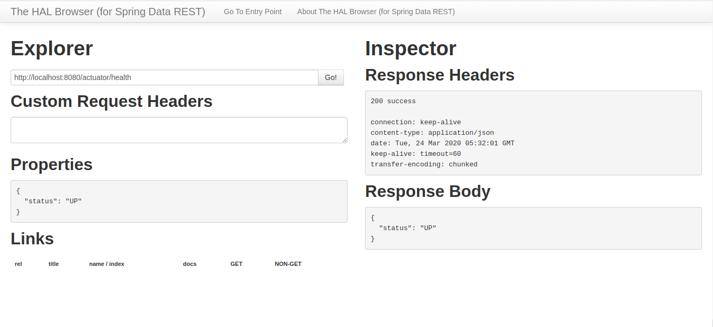
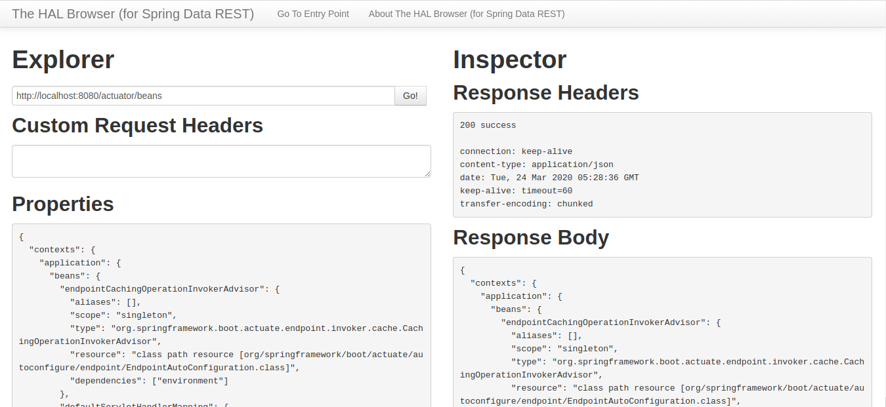

## Exercise : RESTful web service part 1 

#### Note : I have made use of [Project lombok]([https://projectlombok.org/](https://projectlombok.org/)) for generating getters, setters and constructors. 

#### Q1. Create a simple RESTful service in Spring Boot which returns the Response "Welcome to spring boot".

[WelcomeController](project-files/restful-web-service-1/src/main/java/com/chiragbohet/restfulwebservice1/Controllers/WelcomeController.java)

```java
@RestController
public class WelcomeController {

   @GetMapping("/hello")
    public String printWelcomeMessage()
    {
        return "Welcome to Spring Boot!";
    }
}
```

#### Q2. Create an Employee Bean(id, name, age) and service to  perform different operations related to employee.

[Employee](project-files/restful-web-service-1/src/main/java/com/chiragbohet/restfulwebservice1/Entities/Employee.java)
```java
@Getter @Setter @AllArgsConstructor
public class Employee {
    Integer id;
    String name;
    Integer age;
}
```

[EmployeeDaoService](project-files/restful-web-service-1/src/main/java/com/chiragbohet/restfulwebservice1/DAOs/EmployeeDaoService.java) 

```java
@Component
public class EmployeeDaoService {

    //Trying to mock DB behavior with a list
    static List<Employee> employees = new ArrayList<>();

    //Adding some Employee's to the employees list to simulate employees stored in a DB
    static {
        employees.add(new Employee(1, "Chirag", 24));
        employees.add(new Employee(2, "Ajay", 24));
        employees.add(new Employee(3, "Manish", 35));
        employees.add(new Employee(4, "Elon", 40));
    }

    /***
     * Returns list of all Employees, currently in the system.
     * @return List of Employees
     */
    public List<Employee> retrieveAllEmployees() {
        return employees;
    }

    /***
     * Finds and returns a single Employee Object with given id
     * @param id id of the Employee
     * @return
     *      Employee Object, if found with given id
     *      null otherwise
     */
    public Employee retrieveEmployeeById(int id) {
        for (Employee employee : employees)
            if (employee.getId() == id)
                return employee;
        return null;
    }

    /***
     * Adds a new Employee Object to the employees list
     * If id field is not set auto set's the id to current employees count + 1
     * @param employee  Employee Object to be added to the list
     * @return Original Employee Object given as input
     */
    public Employee addEmployee(Employee employee) {
        if (employee.getId() == null)
            employee.setId(employees.size() + 1);

        employees.add(employee);
        return employee;
    }

    /***
     * Deletes Employee with given Id from the employees list.
     * @param id Id of the Employee to be deleted.
     * @return
     *      Employee Object of the Employee which is removed from the list, if found and deleted
     *      null otherwise
     */
    public Employee deleteEmployeeById(int id) {
        if (id > 0) {
            Iterator<Employee> iterator = employees.iterator();

            while (iterator.hasNext()) {
                Employee employeeToDelete = iterator.next();
                if (employeeToDelete.getId() == id) {
                    iterator.remove();
                    return employeeToDelete;
                }
            }
        }

        return null;
    }

    /***
     * Updates Employee Object in the employee list if found one with
     * matching id as input employee Object
     * If not found, creates a new Employee Object
     * @param requestedEmployee the Employee needed to be created/updated
     * @return created/updated Employee
     */
    public Employee createEmployeeIfNotPresentElseUpdate(Employee requestedEmployee) {
        Employee storedEmployee = retrieveEmployeeById(requestedEmployee.getId());

        if (storedEmployee == null) // if not found, create one
            addEmployee(requestedEmployee);

        else // if already present, update
            employees.set(employees.indexOf(storedEmployee), requestedEmployee);

        return requestedEmployee;
    }

}

```

### Note : In the coming questions I have done some exception handling, the content of exception handling files is as follows : 

[UserNotFoundException](project-files/restful-web-service-1/src/main/java/com/chiragbohet/restfulwebservice1/Exceptions/UserNotFoundException.java)

```java
public class UserNotFoundException extends RuntimeException {
    public UserNotFoundException(String message) {
        super(message);
    }
}
```

[ExceptionResponseFormat](project-files/restful-web-service-1/src/main/java/com/chiragbohet/restfulwebservice1/Exceptions/ExceptionResponseFormat.java)

```java
@Getter @AllArgsConstructor
public class ExceptionResponseFormat {
    private Date timestamp;
    private String message;
    private String details;
}
```

[CustomizedResponseEntityExceptionHandler](project-files/restful-web-service-1/src/main/java/com/chiragbohet/restfulwebservice1/Exceptions/CustomizedResponseEntityExceptionHandler.java)

```java
@ControllerAdvice
@RestController
public class CustomizedResponseEntityExceptionHandler
        extends ResponseEntityExceptionHandler {

    // Default exception handler
    @ExceptionHandler(Exception.class)
    public final ResponseEntity<Object> handleAllException(Exception ex, WebRequest request) throws Exception {
        ExceptionResponseFormat exceptionResponseFormat =
                new ExceptionResponseFormat(new Date(),
                        ex.getMessage(),
                        request.getDescription(false));

        return new ResponseEntity(exceptionResponseFormat, HttpStatus.INTERNAL_SERVER_ERROR);
    }

    // UserNotFoundException exception handler
    @ExceptionHandler(UserNotFoundException.class)
    public final ResponseEntity<Object> handleUserNotFoundException(Exception ex, WebRequest request) throws Exception {
        ExceptionResponseFormat exceptionResponseFormat =
                new ExceptionResponseFormat(new Date(),
                        ex.getMessage(),
                        request.getDescription(false));

        return new ResponseEntity(exceptionResponseFormat, HttpStatus.NOT_FOUND);
    }

    // For validation related exceptions
    @Override
    protected ResponseEntity<Object> handleMethodArgumentNotValid(
            MethodArgumentNotValidException ex, HttpHeaders headers, HttpStatus status, WebRequest request) {

        ExceptionResponseFormat exceptionResponseFormat =
                new ExceptionResponseFormat(new Date(),
                        "Validation error, please check the details for more info.",
                        ex.getBindingResult().toString());

        return new ResponseEntity(exceptionResponseFormat, HttpStatus.BAD_REQUEST);
    }

}

```

#### Q3. Implement GET http request for Employee to get list of employees.

[EmployeeController](project-files/restful-web-service-1/src/main/java/com/chiragbohet/restfulwebservice1/Controllers/EmployeeController.java)

```java
@GetMapping("/employees")
    public List<Employee> getAllEmployees() {
        return employeeDaoService.retrieveAllEmployees();
    }
```

#### Q4. Implement GET http request using path variable to get one employee

[EmployeeController](project-files/restful-web-service-1/src/main/java/com/chiragbohet/restfulwebservice1/Controllers/EmployeeController.java)

```java
 @GetMapping("/employees/{id}")
    public Employee getEmployeeWithId(@PathVariable int id) {
        Employee requestedEmployee = employeeDaoService.retrieveEmployeeById(id);

        if (requestedEmployee != null)
            return requestedEmployee;
        else
            throw new UserNotFoundException("No Employee found with id : " + id);
    }
```

#### Q5. Implement POST http request for Employee to create a new employee.

[EmployeeController](project-files/restful-web-service-1/src/main/java/com/chiragbohet/restfulwebservice1/Controllers/EmployeeController.java)

```java
@PostMapping("/employees")
    public ResponseEntity createEmployee(@RequestBody Employee employee) {
        employeeDaoService.addEmployee(employee);
        URI location = ServletUriComponentsBuilder
                .fromCurrentRequest()
                .path("/{id}")
                .buildAndExpand(employee.getId())
                .toUri();

        return ResponseEntity.created(location).build();
    }
```

#### Q6. Imploement Exception Handling for resource not found
##### Already implemented.

#### Q7. Implement DELETE http request for Employee to delete employee

[EmployeeController](project-files/restful-web-service-1/src/main/java/com/chiragbohet/restfulwebservice1/Controllers/EmployeeController.java)

```java
@DeleteMapping("/employees/{id}")
    public Employee deleteEmployeeWithId(@PathVariable int id) {
        Employee deletedEmployee = employeeDaoService.deleteEmployeeById(id);

        if (deletedEmployee != null)
            return deletedEmployee;
        else
            throw new UserNotFoundException("No Employee found with id : " + id);
    }
```

#### Q8. Implement PUT http request for Employee to update employee.

[EmployeeController](project-files/restful-web-service-1/src/main/java/com/chiragbohet/restfulwebservice1/Controllers/EmployeeController.java)

```java
@PutMapping("/employees")
    public Employee editOrCreateEmployee(@RequestBody Employee requestedEmployee) {
        return employeeDaoService.createEmployeeIfNotPresentElseUpdate(requestedEmployee);
    }
```

#### Q9. Apply validation while create a new employee using POST http Request.

[Employee](project-files/restful-web-service-1/src/main/java/com/chiragbohet/restfulwebservice1/Entities/Employee.java)

```java
@Getter @Setter @AllArgsConstructor
public class Employee {

    Integer id;

    @Size(min=2, message = "Required atleast 2 characters in the name!")
    String name;

    @Min(value = 18,message = "Age should be >= 18")
    Integer age;
}
```

[EmployeeController](project-files/restful-web-service-1/src/main/java/com/chiragbohet/restfulwebservice1/Controllers/EmployeeController.java)

```java
@PostMapping("/employees")
    public ResponseEntity createEmployee(@Valid @RequestBody Employee employee) {
        employeeDaoService.addEmployee(employee);
        URI location = ServletUriComponentsBuilder
                .fromCurrentRequest()
                .path("/{id}")
                .buildAndExpand(employee.getId())
                .toUri();

        return ResponseEntity.created(location).build();
    }
```

#### Q10. Configure actuator in your project to check the health of application and get the information about various beans configured in your application. 
##### To enable Actuator in a Sprint Boot application we need to do 2 steps
##### 1. Add actuator dependency

[build.gradle](project-files/restful-web-service-1/build.gradle)

```
	compile group: 'org.springframework.boot', name: 'spring-boot-starter-actuator', version: '2.2.5.RELEASE'
```

##### 2. Expose required metrics endpoints
###### I have exposed all using

[application.properties](project-files/restful-web-service-1/src/main/resources/application.properties)

```
management.endpoints.web.exposure.include = *
```

##### 3. Add HAL browser dependency for convenience (Optional)

[build.gradle](project-files/restful-web-service-1/build.gradle)

```
compile group: 'org.springframework.data', name: 'spring-data-rest-hal-browser', version: '3.2.5.RELEASE'
```

##### screenshots : 

- ##### /actuator/health



- ##### /actuator/beans


